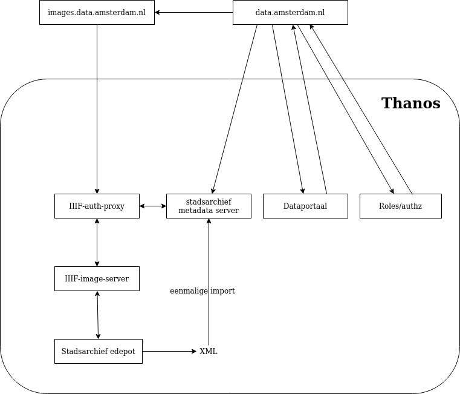

# IIIF Auth Proxy
A proxy to check authentication (from roles) and authorization (combine the role with info from the 
stadsarchief metadata server).

### Infrastructure overview

### Logic

Below is an example url which can be used to call an image. Note that where the urls used to have dollar signs, it 
now uses hyphens instead. 

    https://acc.images.data.amsterdam.nl/iiif/2/edepot:ST-00001-ST0001_00001.jpg/full/400,/0/default.png

In case the user is allowed to view the image and there are no other problems, the image is served in a normal 200.
In case the user is NOT allowed to view the image, the user is served a `401` and an empty messge body.
In any other case resulting in a failure, the user is served a non-`200` response code with the reason for failure 
in the message body. An example is a `404` with a message body saying:

> No metadata could be found for this image

The specific authorization rules can be inspected in [views.py](src/iiif/views.py)

### Running

The server can be run using `docker-compose up`

### Internal connections
The [metadata server](https://github.com/Amsterdam/stadsarchief) and the 
[iiif-image-server](https://github.com/Amsterdam/iiif-image-server) are called using consul urls over http. For 
example, the iiif-image-server is called using `http://iiif.service.consul:8149`. These settings can be overwritten 
using `SERVER_URL` and `SERVER_PORT` env variables in [settings.py](src/settings/settings.py). 
