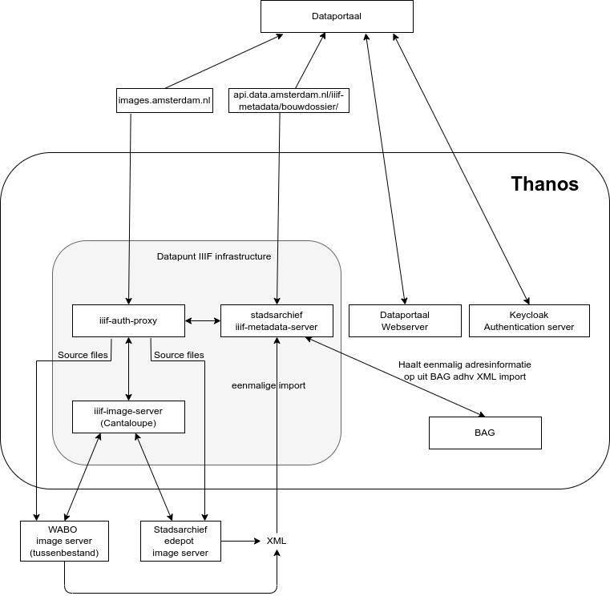

# IIIF Auth Proxy
A proxy to check authentication (from roles) and authorization (combine the role with info from the 
stadsarchief metadata server).

### Infrastructure overview

### Logic

Below is an example url which can be used to call an image. Note that where the urls used to have dollar signs, it 
now uses hyphens instead. 

    https://acc.bouwdossiers.amsterdam.nl/iiif/2/edepot:ST-00001-ST0001_00001.jpg/full/400,/0/default.png

In case the user is allowed to view the image and there are no other problems, the image is served in a normal 200.
In case the user is NOT allowed to view the image, the user is served a `401` and an empty messge body.
In any other case resulting in a failure, the user is served a non-`200` response code with the reason for failure 
in the message body. An example is a `404` with a message body saying:

> No metadata could be found for this image

### Authorization

If the images can be shown to the user are based on two properties:

**access** (Openbaarheid)  and **copyright** (Auteursrecht)

There are three categories of users.

1) Civilians or anybody else. They are identified with an e-mail threshold login.

2) Civil servants of the city of Amsterdam. They are identified by JWT-tokens supplied by a central user/password login. 

3) Civil servants with special rights to see construction files (bouwdossiers). They are also identified by JWT-tokens supplied by a central user/password login and they have 
   special rights to access **bouwdossiers**.

In the metadata the two properties access and copyright are present for every document. The access property can also be present on the **bouwdossier** level.

If access is restricted, either on document or **bouwdossier** level, the document can only be seen by category 3, civil servants with special rights to access **bouwdossiers**.

If access is not restricted, the documents can be accessed by category 2, any civil servant of the municipality of Amsterdam.

If access is not restricted and there is no copyright for the document, the document can also be accessed by category 3 or
anybody identified by e-mail threshold.

With respect to copyright there is the following remark. Legally all drawings are protected by copyright till 70 years after publication(or death of the entitled party).
It is only much less difficult than, for example, with photos. The starting point is: we will publish them (copyright is set to N), unless a rightholder objects.
This should only happen sporadically. To enable identification, we enter the names of manufacturers (**copyright_manufacturers** property) and present them as such.

In addition to **access** and **copyright** in the metadata also the properties **access_restricted_until** and **copyright_until** can be given. These are for information
only and are not used for determining access to the document. This should be handled by future updates to the metadata delivery.

If access is denied to a document https status 401 is returned with a reason. This can be either "Document has copyright restriction" or "Document access is restricted"
and should be presented in the frontend with a appropriate link to the SAA website.

Details for the specific authorization rules can be inspected in [tools.py](src/iiif/tools.py)

### Running

The server can be run using `docker-compose up`

### Internal connections
The [metadata server](https://github.com/Amsterdam/stadsarchief) and the 
[iiif-image-server](https://github.com/Amsterdam/iiif-image-server) are called using consul urls over http. For 
example, the iiif-image-server is called using `http://iiif.service.consul:8149`. These settings can be overwritten 
using `SERVER_URL` and `SERVER_PORT` env variables in [settings.py](src/main/settings.py). 
